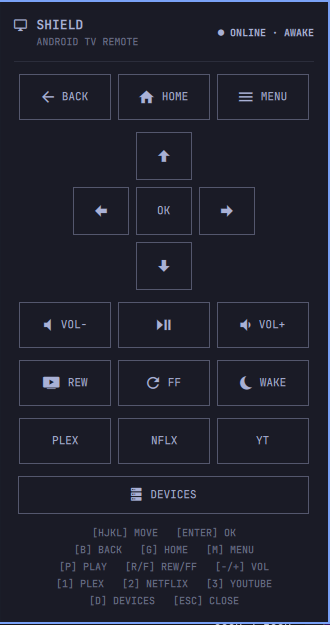

# Android TV Remote for Omarchy

A keyboard-first remote for the Omarchy Quattro bar. It uses the Android TV
Remote protocol — the same one as the Google TV phone app — so there is no ADB
or developer mode. Pair with the six-character code shown on the television.

If the Google TV or Google Home app on a phone can control the box, this plugin
can too.



## Supported devices

Anything running **Android TV** or **Google TV** with the pre-installed
**Android TV Remote Service** (protocol v2, typical on Android 9 and newer).

### Streaming boxes

| Device | Notes |
| --- | --- |
| NVIDIA SHIELD TV (2015, 2017) | 2017 16GB (`darcy`) tested here. Same protocol as Google TV |
| NVIDIA SHIELD TV Pro (2017, 2019) | Disable simplified wake buttons if power/wake fails: **Settings → Remotes & accessories → Simplified wake buttons** |
| Chromecast with Google TV HD (2020) | |
| Chromecast with Google TV 4K (2020) | |
| Google TV Streamer 4K (2024) | |
| Xiaomi Mi Box / Mi Box S | Some Xiaomi boxes cannot be woken once fully off |
| onn. Google TV 4K / 4K Pro | Walmart onn. streaming boxes |
| Dune HD Homatics Box R 4K Plus | |

### TVs

Google TV or Android TV sets from **Sony Bravia**, **TCL**, **Hisense**,
**Philips**, **Xiaomi**, and similar brands. TCL sets may need **Settings →
System → Power and energy → Screenless service** so they stay reachable when
the panel is off.

### Tested here

- Philips 65″ OLED (2020 Android TV, TPM191E platform — OLED805/855/865/935 class)
- NVIDIA SHIELD TV 2017 16GB (`darcy`, advertised as “SHIELD Android TV”) — paired, running Plex during the scan

### Not supported

| Device | Why |
| --- | --- |
| Amazon Fire TV / Fire Stick / Fire Cube | No Android TV Remote Service. Use [Fire TV Remote](https://github.com/ypMrg/omarchy-fire-tv-stick-remote) (ADB) |
| Classic Chromecast (1st/2nd/3rd gen, Ultra, Audio) | Cast receivers only, not Android TV |
| Apple TV | Use [Apple TV Remote](https://github.com/teevans/omarchy-apple-tv-remote) |
| Roku | Use [Roku Remote](https://github.com/Jalv13/omarchy-roku-remote) |

## Features

- Directional navigation, Select, Back, Home, and Menu
- Play/pause, rewind, fast-forward, and volume
- Wake, sleep, and power status
- Local-network discovery, PIN pairing, device switching, and forget
- Devices are remembered by MAC address, so DHCP IP changes after a restart still reconnect
- Shortcuts for Plex, Netflix, and YouTube
- Mouse and keyboard operation from a theme-aware bar panel

## Requirements

- Omarchy Quattro
- Python 3.9 or newer with `venv` support
- An Android TV / Google TV device on the same local network
- Internet access on first launch to install the hash-locked
  [`androidtvremote2`](https://github.com/tronikos/androidtvremote2) dependencies
  (`requirements.lock`) into an isolated environment
- Optional: Avahi's `avahi-browse` for faster discovery; you can always add a
  host by IP

The plugin runs unsandboxed inside `omarchy-shell`. Review the repository
before installing it.

## Install & Setup

```bash
# 1. Install the plugin
omarchy plugin add https://github.com/bjarkimg/omarchy-android-tv-remote.git --enable

# 2. Run one-time explicit setup to provision the hash-locked dependencies into an isolated environment
~/.config/omarchy/plugins/io.github.bjarkimg.android-tv-remote/android-tv-remote setup
```

The setup command creates an isolated Python virtualenv under
`${XDG_DATA_HOME:-$HOME/.local/share}/io.github.bjarkimg.android-tv-remote/` and
installs the fully hash-locked dependency graph (`requirements.lock`) using `pip
install --require-hashes --no-deps`.

Open the bar widget, choose **Devices**, scan or enter the device IP, and type
the six-character PIN shown on the television. Forget a saved device with the
trash button or `X`.

## Controls

| Key | Action |
| --- | --- |
| Arrow keys or H/J/K/L | Navigate |
| Enter | Select / OK |
| B | Back |
| G | Home |
| M | Menu |
| P | Play/pause |
| R / F | Rewind / fast-forward |
| - / + | Volume |
| X | Mute (on Remote) / Remove device (on Devices) |
| W | Wake |
| S / O | Power off / Sleep |
| 1 / 2 / 3 | Plex / Netflix / YouTube |
| D | Devices |
| Escape or Q | Close |

## Update

```bash
omarchy plugin update io.github.bjarkimg.android-tv-remote
```

## Remove

```bash
omarchy plugin remove io.github.bjarkimg.android-tv-remote
```

Optionally remove its Python environment, pairing certs, and remembered devices:

```bash
rm -rf "${XDG_DATA_HOME:-$HOME/.local/share}/io.github.bjarkimg.android-tv-remote"
rm -f "${XDG_STATE_HOME:-$HOME/.local/state}/omarchy/settings/android-tv-remote.json"
```

Older checkouts used `io.github.bjarkimg.shield-remote` and
`shield-remote.json`. Those paths are still read once, then migrated.

## Development

```bash
omarchy plugin validate .
```

## Credits

Panel and session design follows Thomas Evans'
[Apple TV Remote for Omarchy](https://github.com/teevans/omarchy-apple-tv-remote).

NVIDIA, SHIELD, Google TV, Chromecast, Plex, Netflix, and YouTube are trademarks
of their owners.

## License

[MIT](LICENSE)
